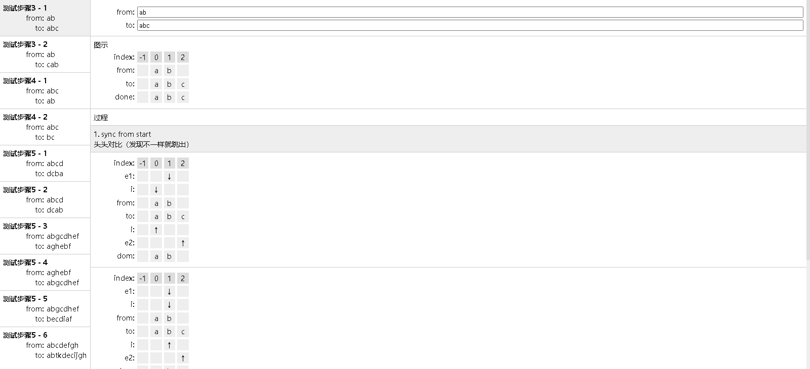

# Vue3 Diff 学习分析

> 如果您觉得还算有些参考价值，麻烦给一颗Star呗！

## Diff 之 patchKeyedChildren

[示例入口](https://xachary.github.io/vue3-diff-study)

> 算法输出过程是完全基于 [Vue3 core](https://github.com/vuejs/core)

> patchKeyedChildren 方法在源码的 [packages\runtime-core\src\renderer.ts](https://github.com/vuejs/core/blob/main/packages/runtime-core/src/renderer.ts) 里面

> patchKeyedChildren 里用到了 getSequence【最长递增子序列】，可以作为另外一个话题单独讨论，示例中只展示输入和输出结果进行图形化展示

### 使用说明

> 左边是预设的一些测试用例；

> 右上方是测试用例输入框，可以自行输入测试用例；（每个小写字符代表一个节点的key，不能重复哟）

### 示例源码

> 如果您对示例的实现感兴趣，可以移步至：[vue3-core-study](https://github.com/xachary/vue3-core-study)，查看带过程反馈的 [patchKeyedChildren](https://github.com/xachary/vue3-core-study/blob/main/packages/runtime-core/src/renderer.ts)

## 感谢支持

> 如果您觉得还算有些参考价值，麻烦给一颗Star呗！